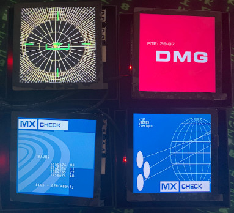

<!-- PROJECT SHIELDS -->
[![Contributors][contributors-shield]][contributors-url]
[![Forks][forks-shield]][forks-url]
[![Stargazers][stars-shield]][stars-url]
[![Issues][issues-shield]][issues-url]
[![MIT License][license-shield]][license-url]

<!-- PROJECT LOGO -->
<br />
<p align="center">
  <a href="https://github.com/AntoineMeheut/Hal9000Screen">
    
  </a>

  <h3 align="center">Creation of HAL control screens </h3>

  <p align="center">
    The goal of this project is to share the hardware, software and the implementation plan, to obtain the control screens of HAL 9000.
    <br />
    <br />
    <a href="https://github.com/AntoineMeheut/Hal9000Screen">View Demo</a>
    ·
    <a href="https://github.com/AntoineMeheut/Hal9000Screen/issues">Report Bug</a>
    ·
    <a href="https://github.com/AntoineMeheut/Hal9000Screen/issues">Request Feature</a>
  </p>
</p>

<!-- TABLE OF CONTENTS -->
## Table of Contents

* [About the Project](#about-the-project)
  * [My goals](#My-goals)
  * [Features](#Features)
  * [Feedback](#Feedback)
  * [Experience sharing](#Experience-sharing)
* [Hardware](#Hardware)
  * [Shopping list](#Shopping-list)
* [Software](#Software)
  * [Clone this repo](#Clone-this-repo)
  * [Setup SD Cards](#Setup-SD-Cards)
* [Installation of images](#Installation-of-images)
  * [Installation of QIV](#Installation-of-QIV)
  * [Creating an automatic start-up script](#Creating-an-automatic-startup-script)
  * [Creation of the QIV launch script](#Creation-of-the-QIV-launch-script)
  * [Create a photo library of Hal monitors](#Create-a-photo-library-of-Hal-monitors)
* [Installation of Hyperpixel](#Installation-of-Hyperpixel)
* [And here is the result](#And-here-is-the-result)
* [Usage](#usage)
* [Roadmap](#roadmap)
* [Contributing](#contributing)
* [License](#license)
* [Contact](#contact)
* [Acknowledgements](#acknowledgements)

<!-- ABOUT THE PROJECT -->
## About The Project
This project is part of a more complex one, which aims to build a private cloud to make fun demonstrations of what
a cloud is. I really enjoy demistifying very complex technical concepts and helping people who are interested
to understand what that means in reality. Since it is difficult to carry an entire machine room with me,
I therefore wondered how to build a portable cloud to show in a simple and fun way what it really is: cards, disks,
a network and electricity. Fan of 2001 the Space Odyssey, I told myself that I was going to use some references
to this film, to share my knowledge with as many people as possible.

So the goal of this project is to make 4 HAL 9000 control screens. These screens in the movie show information
that changes regularly. The objective of the final project being to fit a cloud, the HAL camera and its control screens
into something transportable, for this project I had to look for screens that were not too large, ditto for the hardware
necessary to make them live.

### My goals

* Create the HAL console control screens
* Find LCD screens, not too big and square in shape
* Connect a not too bulky computer to these screens
* Find images of HAL control screens
* Set up a technical solution to display these images

This is what I want to get


### Features

* Hardware pattern
* Using Raspberry Pi 3 Model B+ that I recycled from my first cluster project
* Installation of QIV (Quick Image Viewer) a software for viewing images
* Setting up an autostart on a Raspberry Pi
* Using a shell script for execution when the Raspberry Pi starts up

### Feedback

* Putting the components together, installing the scripts and images and starting it all up is pretty fast
* So that the images are aligned and of good size it is preferable to put them at a size of 720x720
* The display quality of these small screens is impressive

### Experience sharing

* Warning: it is better to do it very slowly when you plug in the raspberry with the screen and avoid pressing the screen as much as possible
* Keep the screen protector during assembly to avoid fingerprints

## Hardware
### Shopping list
Here is the first part of a shopping list for the project, with links (not affiliated) to references
what I have used. I let you search for other equipment and especially how to buy this equipment according
to your favorite stores.


| Number | Parts |
| ------ | ---- |
| 4 | [Raspberry Pi 3 Model B+](https://www.raspberrypi.org/products/raspberry-pi-3-model-b-plus/) |
| 4 | [Micro SD Card 16 Go](https://shop.westerndigital.com/products/memory-cards/sandisk-ultra-uhs-i-microsd#SDSQUNC-016G-AN6MA) |
| 4 | [HyperPixel 4.0 Square](https://shop.pimoroni.com/products/hyperpixel-4-square?variant=30138251444307) |
| 4 | [USB Cables](https://www.startech.com/Cables/USB-2.0/Micro/mobile-charge-sync-micro-usb-cable-15cm~USBAUB15CMBK) |
| 1 | [PowerPort](https://www.anker.com/products/variant/powerport-5/A2124112) |


## Software

### Clone this repo if you want

	git clone https://github.com/AntoineMeheut/Hal9000Screen.git Hal9000Screen
	cd Hal9000Screen

### Setup SD Cards


You will find all the information you need to install a Raspberry OS on your card. The type of OS we need
for this project is a Raspberry Pi OS (32-bit) with desktop

https://www.raspberrypi.org/documentation/installation/installing-images/

### Before plugging in your HyperPixel display
I advise you to connect your raspberry to another screen, keyboard and smile before connecting the HyperPixel screen,
this will allow you to connect your Pi to your Wifi, to make the necessary updates to the OS and to carry out
the installations described below on a more comfortable screen. And most importantly, it will allow you to install
the software part that accompanies the Hyperpixel screen, because without this software your raspberry
will not be able to communicate correctly with this screen.

## Installation of images
### Installation of QIV
QIV (Quick Image Viewer) is software for viewing images. It was developed with gdk / imlib, which makes it faster
than many other classic viewers.

```
sudo apt-get install qiv
```

### Creating an automatic startup script
When starting the desktop, LXDE automatically launches the scripts found in the /home/pi/.config/autostart folder

We will therefore create this folder on our Raspberry Pi and then create the script that will be launched at startup
from the office.

You can also copy the files found here to your raspberry [resources](https://github.com/AntoineMeheut/Hal9000Screen/tree/master/resources)

```
mkdir /home/pi/.config/autostart
cd /home/pi/.config/autostart
sudo nano slideshow.desktop
sudo chmod +x slideshow.desktop
```

Once nano is open, insert the following lines into the file.

```
[Desktop Entry]
Type=Application
Exec=lxterminal -e /home/pi/slideshow.sh
```

### Creation of the QIV launch script
The script to start the application is created in the /home/pi folder

You can also copy the files found here to your raspberry [resources](https://github.com/AntoineMeheut/Hal9000Screen/tree/master/resources)

```
cd /home/pi
sudo nano slideshow.sh
sudo chmod +x slideshow.sh
```

Once nano is open, insert the following lines into the file.

```
#!/bin/bash
#slideshow script
sleep 1
export DISPLAY=:0.0
qiv -f -R -S -n -s -r -d 5 -l -u -t -i -m  /home/pi/pics/*
```

### Create a photo library of Hal monitors

Place images of Hal's control screens in the /home/pi/pics directory

You can easily find images on the internet, in photos from the film or in wallpapers.

## Installation of Hyperpixel
All the useful explanations can be found on this link.

https://learn.pimoroni.com/tutorial/sandyj/getting-started-with-hyperpixel-4

## And here is the result


<!-- GETTING STARTED -->
## Getting Started

To get a local copy up and running follow these simple steps.

### Installation
 
Clone the repo
```
git clone https://github.com/AntoineMeheut/Hal9000Screen
```

<!-- USAGE EXAMPLES -->
## Usage

Once you have followed the steps to prepare your Raspberry Pi, simply turn on the Raspberry
and everything will start by itself.

<!-- ROADMAP -->
## Roadmap

See the [Project](https://github.com/AntoineMeheut/Hal9000Screen/projects) for a list of proposed features (and known issues).

<!-- CONTRIBUTING -->
## Contributing

Contributions are what make the open source community such an amazing place to be learn, inspire, and create. Any contributions you make are **greatly appreciated**.

1. Fork the Project
2. Create your Feature Branch (`git checkout -b feature/AmazingFeature`)
3. Commit your Changes (`git commit -m 'Add some AmazingFeature'`)
4. Push to the Branch (`git push origin feature/AmazingFeature`)
5. Open a Pull Request

<!-- LICENSE -->
## License

Distributed under the MIT License. See `LICENSE` for more information.

<!-- CONTACT -->
## Contact

If you want to contact me [just clic](mailto:github.contacts@protonmail.com)

Project Link: [https://github.com/AntoineMeheut/Hal9000Screen](https://github.com/AntoineMeheut/Hal9000Screen)


<!-- MARKDOWN LINKS & IMAGES -->
<!-- https://www.markdownguide.org/basic-syntax/#reference-style-links -->
[contributors-shield]: https://img.shields.io/github/contributors/AntoineMeheut/Hal9000Screen?color=green
[contributors-url]: https://github.com/AntoineMeheut/Hal9000Screen/graphs/contributors
[forks-shield]: https://img.shields.io/github/forks/AntoineMeheut/Hal9000Screen
[forks-url]: https://github.com/AntoineMeheut/Hal9000Screen/network/members
[stars-shield]: https://img.shields.io/github/stars/AntoineMeheut/Hal9000Screen
[stars-url]: https://github.com/AntoineMeheut/Hal9000Screen/stargazers
[issues-shield]: https://img.shields.io/github/issues/AntoineMeheut/Hal9000Screen
[issues-url]: https://github.com/AntoineMeheut/Hal9000Screen/issues
[license-shield]: https://img.shields.io/github/license/AntoineMeheut/Rokc
[license-url]: https://github.com/AntoineMeheut/Rokc/blob/master/LICENSE
